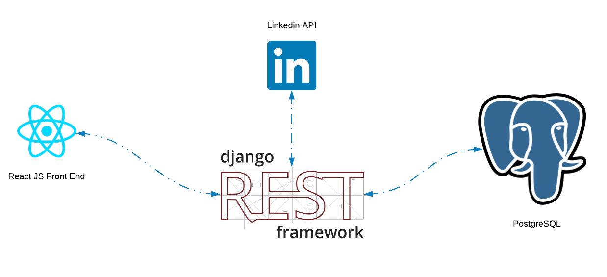
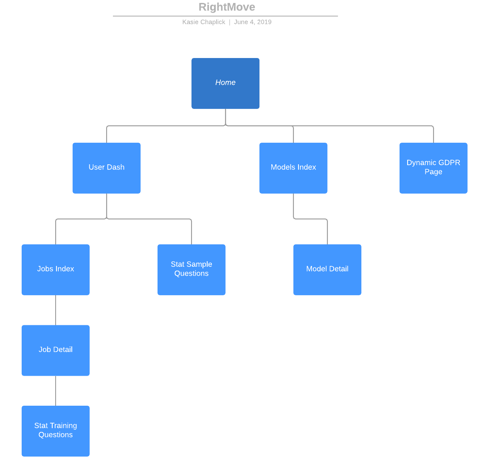

# RightMove
_intelligent career design_

## Why?
When we are looking for a new gig, it is easy to cling to the simple KPIs - money, time off, fancy office digs ets. But the understanding of how real factors play into elements like our personal fulfilment, our life trajectory, and our ability to find "flow" requires a more empirical approach. We can use science and math to help see the big picture, and determine with certainty which role is the RightMove for you. 

## Where did this come from?
This started as a spreadsheet to compare different factors between companies. Things like "Salary" and "Healthcare" needed to be weighted more than "Free Gym", so we added some basic statical z-score normalization. This expanded to using natural language questions to further weight the candidate metrics, and the idea that we could use post-hiring satisfaction surveys to train an ML model.. the rest is history. 

## Architecture

RightMove will use a React.js SPA while both application behavior and machine learning models will live within the Django REST framework. Data will be stored in postgresql. Training data obtained from the Linkedin API via OAUTH login may also be incorporated. 

## SiteMap

The site map will consist of a few key user stories:
- as a user I want to be able to answer questions about me to train the model
- as a user I want to be able to answer questions about a job to see how it fits
- as a user I want to be able to view job results side by side and compare 
- as a user I want to be able to pick which stat model is used for a fit
- as a user I want to provide feedback after getting a job to help teach the model for future job seekers

## Roles 
- the **design UX team** will create the mockups, user journeys, and interaction designs that the web app team will build.
- the **web app team** will handle the react application, the user authentication and the OAUTH login calls. They will handle the MVC layer transactional database ORM design. 

- the **data science team** will build the model(s) as modules with a simple API for integration into the application model layer.

- the **devops team** will containerize and deploy the application, and set up basic CI/CD.
 
## MVP 
- user can log in via OAUTH and answer a number of questions about themselves
- user can create a new job and answer questions about that job
- user is provided a resulting score for that job
- one single static weighted model with supervision (no ML)
- user can answer post-hire questions 

## Stretch Goals (long-term)
- user can see forest chart of their weighted values post-questions
- user can save and edit answering job questions
- user is emailed via MailChimp etc to request post-hire questions at intervals automatically
- more than one model
- ML 
- OAUTH data incorporated in model 
