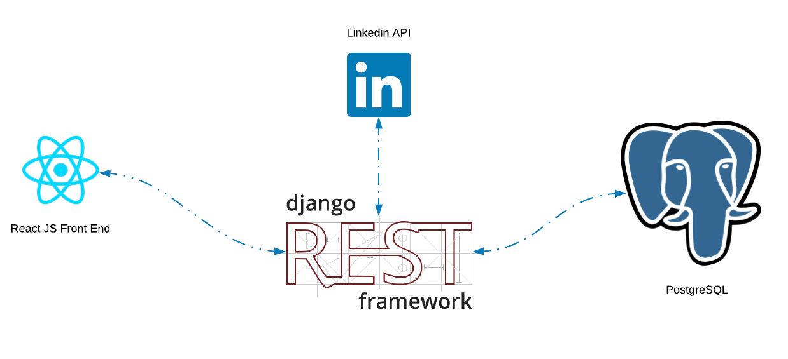

# RightMove
_intelligent career design_

## Why?
When we are looking for a new gig, it is easy to cling to the simple KPIs - money, time off, fancy office digs ets. But the understanding of how real factors play into elements like our personal fulfilment, our life trajectory, and our ability to find "flow" requires a more empirical approach. We can use science and math to help see the big picture, and determine with certainty which role is the RightMove for you. 

## Where did this come from?
This started as a spreadsheet to compare different factors between companies. Things like "Salary" and "Healthcare" needed to be weighted more than "Free Gym", so we added some basic statical z-score normalization. This expanded to using natural language questions to further weight the candidate metrics, and the idea that we could use post-hiring satisfaction surveys to train an ML model.. and the rest is history. 

## Architecture
 
